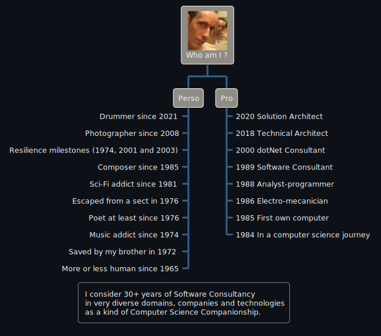

## Repositories naming

The .Net libraries names, and the namespaces they contain, are unconventional and do not follow
the usual namings found in the framework because naming conventions in the framework evolved
over time and are not always consistent across components

For instance, **System.Text.Json** is about serialization, and **System.Xml.Serialization** is handling text data.

So instead of trying to follow rules that do not exist, that change over time or that depend on the team that created the components;
I prefer being consistent and predictable so you just have the surprise once: on the first library you use.

```
Scal.{gerund}.{subjects}(.{variations})
```

- The first part is, as adviced, a company/person name.
- The second part is a gerund form of a verb describing what you can do with the library.
- The third part is a subject, a plural form of a noun, a technology, or **Abstractions**.
- If present, additional parts may denote variations or specializations.

When it exists, the **Abstractions** library contains the models and contracts used and implemented by the other libraries of the family.
It may also contain generic implementations or base classes as long as they remain usable in all cases.

### Examples

```
Scal.Interpreting.Commands
Scal.Serializing.Abstractions
Scal.Serializing.Csv
Scal.Serializing.Ini
Scal.Serializing.Json
Scal.Serializing.Json.Schemas
Scal.Serializing.Xml
Scal.Serializing.Yaml
```

### Exceptions

The MSBuild Sdk's project are named **Scal.Sdk.xxx**.
